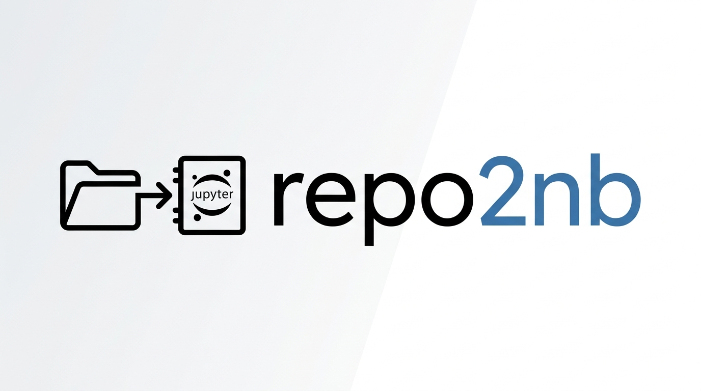

# repo2nb



repo2nb is an open-source Python CLI tool that converts a local code repository into a self-contained Jupyter notebook (`.ipynb`) designed natively to run on Kaggle's free GPU environment. 

It reconstructs your entire repo in Kaggle's `/kaggle/working` directory using Python's `%%writefile` magic cells, and integrates git for version control so you can pull, test, and push fixes back to your remote repository without ever leaving the Kaggle interface.

## Motivation
*This is a tool I made for personal use first, then I wanted to publish it.*

My motivation was that I wanted to securely run a training repo on Kaggle, but it was scattered across directories and Python files. It is extremely frustrating copying all of this into a notebook and debugging why it's giving an error. 

I used to do workarounds like uploading the repo as a dataset and starting from there. It was exhausting and wasted a couple of minutes just to realize I missed an indented line! Attempting the same flow manually using git for authenticating myself, pushing, and pulling for simple microscopic changes, which was equally painful. `repo2nb` automates all of this seamlessly.

**Heads Up:** This project is intended for personal and academic projects. It is specifically designed for students and hobbyists like myself who want to quickly leverage free GPU compute without friction, rather than managing massive corporate repositories with hundreds of nested files!

## Installation

```bash
pip install repo2nb
```

## Usage

```bash
# Convert your local project to a Kaggle notebook
python -m repo2nb ./my_project --output my_project_kaggle.ipynb
```

Then literally just upload the resulting `.ipynb` file to Kaggle!

### Options

- `--output`, `-o`: Specify the output notebook path. Defaults to `<folder_name>.ipynb`.
- `--omit-instructions`: Omits the beginner-friendly warning cells and instructional git cheat sheets. Perfect for power users who already know the setup routine.
- `--ignore-extra`: Provide extra file extensions to ignore entirely (e.g., `--ignore-extra ".yaml .json"`). These files will be completely omitted from the generated notebook.
- `--include`: Force include specific file extensions that are usually skipped as binary/data (e.g., `--include ".csv .json"`).

## Features

- **Instant Rebuild**: Automatically translates your local file tree into correctly ordered `%%writefile` blocks. 
- **Git Integration**: Injects pre-formatted shell cells for initializing Git, adding tokens, selecting branches, pulling, and pushing.
- **Smart Filtering**: Automatically skips cached data, virtual environments (`.venv`), `uv` lock files, heavy binaries (`.pt`, `.pkl`, `.jpg`), and dataset files (`.csv`, `.parquet`) so your final notebook remains incredibly lightweight.
- **Visual Segregation**: Creates unmissable structural phases isolating where the automatic repo build ends and where your actual coding workspace begins.
- **Built-in Git Cheat Sheet**: Gives you immediate interactive access to `git status`, `git rm -rf`, and `git mv` blocks directly in the UI.

## Important Conventions & Security

**Security & Publishing:**
`repo2nb` uses Kaggle's native secrets manager to inject your GitHub token at runtime. Your token is never hardcoded, never visible in cell output, and the notebook remains safe to share publicly. Additionally, ensure that Kaggle's `.virtual_documents` directory is added to your `.gitignore` before pushing any changes to avoid leaking Kaggle's system files into your repo.

**Run All Only Once:**
When you first start your Kaggle session, use **"Run All"** to bootstrap the directory structure and recreate the files.
**After the initial setup, run cells individually as needed.** Using "Run All" again may overwrite any local manual code changes you have made that session!

**Branch Management:**
The notebook's git hooks default to `main`. The generated code blocks remind you to swap `"main"` for your target branch name if you are pulling or committing to a different branch.  

## Video Tutorial
[](https://youtu.be/B8hVJY7YLzE)  
 

## Reporting Issues

Found a bug or have a feature request? Please open an issue on the [GitHub Issues page](https://github.com/David-Magdy/repo2nb/issues).

### Before opening an issue
- Check if the issue has already been reported
- Make sure you are on the latest version: `pip install --upgrade repo2nb`

### When reporting a bug, please include
- Your operating system and Python version
- The command you ran
- The full error message or unexpected output
- A minimal example of the repo structure that triggered the issue if possible

### Feature requests
Feature requests are welcome. Describe the use case you have in mind and why the current tool doesn't cover it, the more specific the better.