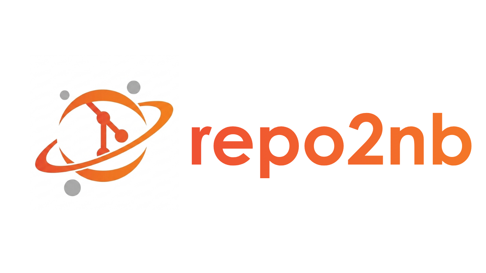

# repo2nb



repo2nb is an open-source Python CLI tool that converts a local code repository into a self-contained Jupyter notebook (`.ipynb`) designed natively to run on Kaggle's free GPU environment — and now Google Colab too.

## Video Tutorial
### [repo2nb Quick Start Guide](https://youtu.be/alpcOEds54c) 

## Motivation
*This is a tool I made for personal use first, then I wanted to publish it.*

My motivation was that I wanted to securely run a training repo on Kaggle, but it was scattered across directories and Python files. It is extremely frustrating copying all of this into a notebook and debugging why it's giving an error. 

I used to do workarounds like uploading the repo as a dataset and starting from there. It was exhausting and wasted a couple of minutes just to realize I missed an indented line! Attempting the same flow manually using git for authenticating myself, pushing, and pulling for simple microscopic changes, which was equally painful. `repo2nb` automates all of this seamlessly.

> [!NOTE]
> This project is intended for personal and academic projects. It is specifically designed for students and hobbyists like myself who want to quickly leverage free GPU compute without friction, rather than managing massive corporate repositories with hundreds of nested files!

## Installation

```bash
pip install repo2nb
```

## Usage

```bash
# Convert your local project into a Kaggle-ready notebook
python -m repo2nb ./my_project --output my_project_kaggle.ipynb
```

Then literally just upload the resulting `.ipynb` file to Kaggle!

That's the whole idea: one command turns your file tree into a notebook that rebuilds your repo on a free GPU machine, installs your dependencies, and comes pre-wired with secure git auth so you can pull and push from the platform.

## What you get

- **Instant Rebuild**: Automatically translates your local file tree into correctly ordered `%%writefile` blocks. 
- **Git Integration**: Injects pre-formatted shell cells for initializing Git, adding tokens, selecting branches, pulling, and pushing.
- **Smart Filtering**: Automatically skips cached data, virtual environments (`.venv`), lock files, heavy binaries (`.pt`, `.pkl`, `.jpg`), and dataset files (`.csv`, `.parquet`) so your final notebook remains incredibly lightweight.
- **Dependency Auto-Detection**: Resolves dependencies from poetry, uv, requirements.txt, or your actual imports — and emits one plain `pip install` cell.
- **Reverse Mode**: Reconstruct your local repo from a generated notebook (`repo2nb reverse`), closing the loop on Kaggle-side edits.
- **Incremental Sync**: Update an existing notebook in place after local changes (`repo2nb sync`) instead of regenerating from scratch.
- **Multi-Target**: Generate for Kaggle (default) or Google Colab (`--target colab`).
- **Visual Segregation**: Creates unmissable structural phases isolating where the automatic repo build ends and where your actual coding workspace begins.
- **Built-in Git Cheat Sheet**: Gives you immediate interactive access to `git status`, `git rm -rf`, and `git mv` blocks directly in the UI.

## Learn more

| Doc | Contents |
|---|---|
| [TUTORIAL.md](TUTORIAL.md) | Every command and flag, dependency detection, `.repo2nbignore`, reverse & sync workflows, Colab setup, conventions |
| [SECURITY.md](SECURITY.md) | How secrets are handled and what the tool writes to your machine |
| [SUPPORT.md](SUPPORT.md) | Getting help and reporting bugs |
| [CONTRIBUTING.md](CONTRIBUTING.md) | Development setup, project layout, PR guidelines |

## Reporting Issues

Found a bug or have a feature request? Head over to [SUPPORT.md](SUPPORT.md) for how to report it well.
